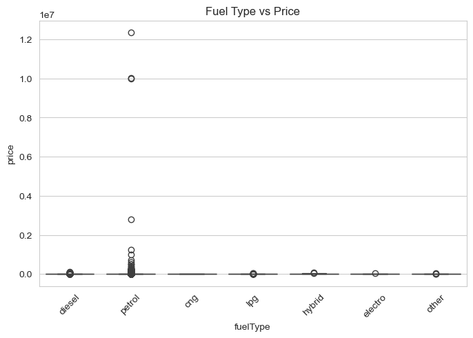
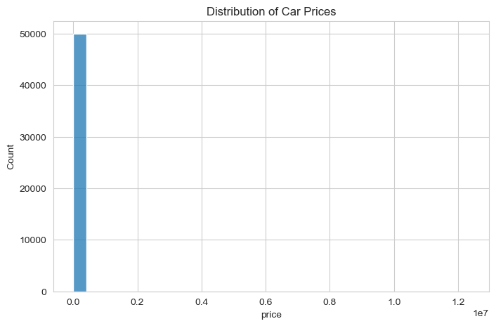
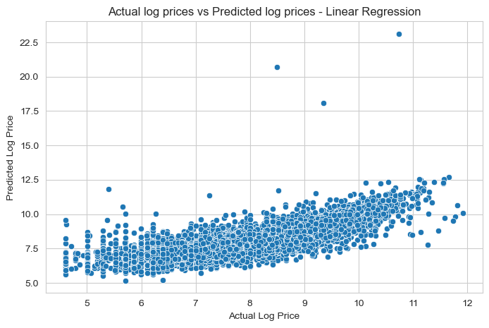

# Used Car Price Prediction – Regression Analysis

[](https://colab.research.google.com/github/nikkibhoot-29/UsedCarPrice-Regression-Analysis/blob/main/Regression%20Case%20Study%20-%20Portfolio.ipynb)

Predictive modeling of used car prices using regression techniques, with emphasis on feature influence and model comparison.

---

## Overview

Used car pricing is influenced by multiple factors such as age, power, brand, and usage patterns.
This project builds regression models to estimate car prices and analyze how different features contribute to price variation.

The focus is on developing reliable predictive models while understanding the underlying drivers of price.

---

## Problem

Estimate the price of used cars based on structured features, while handling data quality issues such as missing values, outliers, and inconsistent records.

---

## Data

The dataset consists of used car attributes including:

* vehicle age (derived from registration year)
* power and engine-related features
* brand and categorical attributes
* usage-related variables

Data was cleaned and transformed to support regression modeling.

---

## Methodology

### Data Preparation

* Removal of irrelevant columns
* Handling missing values (omission and imputation)
* Treatment of extreme outliers (price, power, registration year)

### Feature Engineering

* Derived **Age** from registration details
* Encoding of categorical variables using dummy variables

---

## Modeling

### Models Used

* Linear Regression
* Random Forest Regressor

---

## Evaluation

Models were evaluated using:

* Mean Squared Error (MSE)
* Root Mean Squared Error (RMSE)
* R² Score

### Results

| Model             | R² Score    |
| ----------------- | ----------- |
| Linear Regression | 0.65 – 0.68 |
| Random Forest     | 0.77 – 0.81 |

→ Random Forest performs better by capturing non-linear relationships in the data.

---

## Key Insights

* Car price is strongly influenced by power and age
* Linear models capture general trends but miss non-linear effects
* Random Forest provides better performance due to its ability to model complex relationships
* Log transformation improves prediction stability and reduces skewness

---

## Visual Insights

### Feature Relationships



### Distribution of Cars



### Actual vs Predicted (Linear Regression)



---

## Execution

The project is implemented in:

* Jupyter Notebook (analysis & experimentation)
* `main.py` (structured pipeline execution)

Install dependencies:

```bash 
pip install -r requirements.txt
```

Run:

```bash
python main.py
```

---

## Tech Stack

Python · Pandas · NumPy · Scikit-learn · Matplotlib · Seaborn

---

## Closing Note

Price prediction is not only about fitting models, but understanding how features interact and influence outcomes.
This project highlights the importance of balancing model performance with interpretability.
